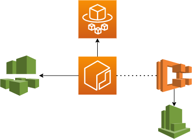

# Infrastructure



This application is deployed using [`AWS CDK`](https://aws.amazon.com/cdk/) and consists of two stacks:

1. Elastic Container Registry repository for keeping Docker images of the application
2. Fargate service stack that runs the Docker image from the repository.

## Deploying

### Prerequisites

```sh
$ npm install

# Optionally install the AWS CLI
$ brew install awscli
```

### Elastic Container Registry
First we will deploy the Elastic Container Registry stack (`RegistryStack`):

```sh
$ npm run deploy -- RegistryStack

RegistryStack: deploying...

 ✅  RegistryStack (no changes)

Outputs:
RegistryStack.ExportsOutputFnGetAttContainerRegistryAppRepositoryDF5AF1CDArn54D5AF48 = arn:aws:ecr:<region>:<account-id>:repository/kafkajs-canary-app
RegistryStack.ExportsOutputRefContainerRegistryAppRepositoryDF5AF1CD2FA9DDCB = kafkajs-canary-app
```

### Secrets

Before deploying the app, you need to create three parameters in AWS Parameter Store, which will be made available to the app container:

1. `/kafkajs-canary-app/kafka-host` (`String`) - bootstrap Kafka broker. 
2. `/kafkajs-canary-app/kafka-username` (`SecureString`) - SASL username
3. `/kafkajs-canary-app/kafka-password` (`SecureString`) - SASL password.
4. `/kafkajs-canary-app/sentry-dsn` (`SecureString`) - **Optional** A Sentry DSN for error reporting

These can either be created through the AWS console or via the CLI:

```sh
$ aws ssm put-parameter --name "/kafkajs-canary-app/kafka-host" --type String --value "kafka:9092"
$ aws ssm put-parameter \
    --name "/kafkajs-canary-app/kafka-username" \
    --value "Username" \
    --type "SecureString"
$ aws ssm put-parameter \
    --name "/kafkajs-canary-app/kafka-password" \
    --value "Password" \
    --type "SecureString"
```

### Pushing Docker image to registry

> See [../app/README.md](../app) for how to build the app image. We will assume that
> you have already built an image named `kafkajs-canary-app` locally.

In order for ECS to be able to pull the image from the registry, we first need to make sure that we push the image to it.

```sh
# First, we authenticate against the registry:
$ aws [--profile=<profile>] ecr get-login-password --region <region> | docker login --username AWS --password-stdin <account-id>.dkr.ecr.<region>.amazonaws.com
Login Succeeded

# Now we push the image. Note that we are pushing the `latest` tag here.
# Normally we would push a version tag corresponding to the kafkajs version used.
$ docker push <account-id>.dkr.ecr.<region>.amazonaws.com/kafkajs-canary-app:latest
```

### App Stack

Finally we can deploy the app stack (`AppStack`), which will create our Fargate service with its ECS cluster, and finally deploy our task to it:

```sh
# Note that we need to specify the app version as a parameter. This version
# corresponds to the Docker image tag that we pushed (i.e. `latest`)
$ npm run deploy -- AppStack --parameters version=latest

Including dependency stacks: RegistryStack
RegistryStack
RegistryStack: deploying...

 ✅  RegistryStack (no changes)

Outputs:
RegistryStack.ExportsOutputFnGetAttContainerRegistryAppRepositoryDF5AF1CDArn54D5AF48 = arn:aws:ecr:<region>:<account-id>:repository/kafkajs-canary-app
RegistryStack.ExportsOutputRefContainerRegistryAppRepositoryDF5AF1CD2FA9DDCB = kafkajs-canary-app

Stack ARN:
arn:aws:cloudformation:<region>:<account-id>:stack/RegistryStack/a17ebf10-e20a-11ea-8ef2-067c15f30dda
AppStack
AppStack: deploying...
AppStack: creating CloudFormation changeset...

 ✅  AppStack

Stack ARN:
arn:aws:cloudformation:<region>:<account-id>:stack/AppStack/ba434d40-e22d-11ea-8ef2-067c15f30dda
```

At this point we can inspect our service in the AWS console or via the CLI.

```sh
$ aws ecs list-services --cluster=AppStack-AppCluster99B78AC1-J1jakrB0VYEy
{
    "serviceArns": [
        "arn:aws:ecs:<region>:<account-id>:service/AppStack-AppAppFargateServiceADF58A48-OG9K63O4XHXS"
    ]
}

$ aws ecs describe-services --cluster=AppStack-AppCluster99B78AC1-J1jakrB0VYEy --service=arn:aws:ecs:<region>:<account-id>:service/AppStack-AppAppFargateServiceADF58A48-OG9K63O4XHXS
{
    "services": [
        {
            "serviceArn": "arn:aws:ecs:<region>:<account-id>:service/AppStack-AppAppFargateServiceADF58A48-OG9K63O4XHXS",
            "serviceName": "AppStack-AppAppFargateServiceADF58A48-OG9K63O4XHXS",
            "clusterArn": "arn:aws:ecs:<region>:<account-id>:cluster/AppStack-AppCluster99B78AC1-J1jakrB0VYEy",
            "loadBalancers": [],
            "serviceRegistries": [],
            "status": "ACTIVE",
            "desiredCount": 1,
            "runningCount": 1,
            "pendingCount": 0,
            "launchType": "FARGATE",
            "platformVersion": "LATEST",
            "taskDefinition": "arn:aws:ecs:<region>:<account-id>:task-definition/AppStackAppAppTaskDefinitionBDE434AC:1",
            "deploymentConfiguration": {
                "maximumPercent": 200,
                "minimumHealthyPercent": 50
            },
            "deployments": [
                {
                    "id": "ecs-svc/2608521618029151379",
                    "status": "PRIMARY",
                    "taskDefinition": "arn:aws:ecs:<region>:<account-id>:task-definition/AppStackAppAppTaskDefinitionBDE434AC:1",
                    "desiredCount": 1,
                    "pendingCount": 0,
                    "runningCount": 1,
                    "createdAt": "2020-08-19T17:08:50.381000+02:00",
                    "updatedAt": "2020-08-19T18:27:52.643000+02:00",
                    "launchType": "FARGATE",
                    "platformVersion": "1.3.0",
                    "networkConfiguration": {
                        "awsvpcConfiguration": {
                            "subnets": [
                                "subnet-0c371d47e505ab836",
                                "subnet-0a8bf6b2abe656702"
                            ],
                            "securityGroups": [
                                "sg-09dd01bb3748dd8da"
                            ],
                            "assignPublicIp": "DISABLED"
                        }
                    }
                }
            ],
            "roleArn": "arn:aws:iam::<account-id>:role/aws-service-role/ecs.amazonaws.com/AWSServiceRoleForECS",
            "events": [
                {
                    "id": "64134380-03d4-4150-852f-2414129ce7a9",
                    "createdAt": "2020-08-19T18:27:52.651000+02:00",
                    "message": "(service AppStack-AppAppFargateServiceADF58A48-OG9K63O4XHXS) has reached a steady state."
                },
                {
                    "id": "6c26cbd7-acb3-402e-91f2-ee60b9e9cad4",
                    "createdAt": "2020-08-19T18:27:21.535000+02:00",
                    "message": "(service AppStack-AppAppFargateServiceADF58A48-OG9K63O4XHXS) has started 1 tasks: (task b176b8fc-5769-4d0d-8569-9c7956d30ff3)."
                }
            ],
            "createdAt": "2020-08-19T17:08:50.381000+02:00",
            "placementConstraints": [],
            "placementStrategy": [],
            "networkConfiguration": {
                "awsvpcConfiguration": {
                    "subnets": [
                        "subnet-0c371d47e505ab836",
                        "subnet-0a8bf6b2abe656702"
                    ],
                    "securityGroups": [
                        "sg-09dd01bb3748dd8da"
                    ],
                    "assignPublicIp": "DISABLED"
                }
            },
            "schedulingStrategy": "REPLICA",
            "createdBy": "arn:aws:iam::<account-id>:root",
            "enableECSManagedTags": false,
            "propagateTags": "NONE"
        }
    ],
    "failures": []
}
```